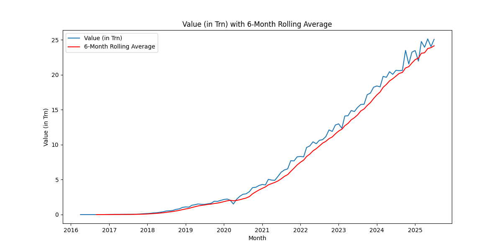
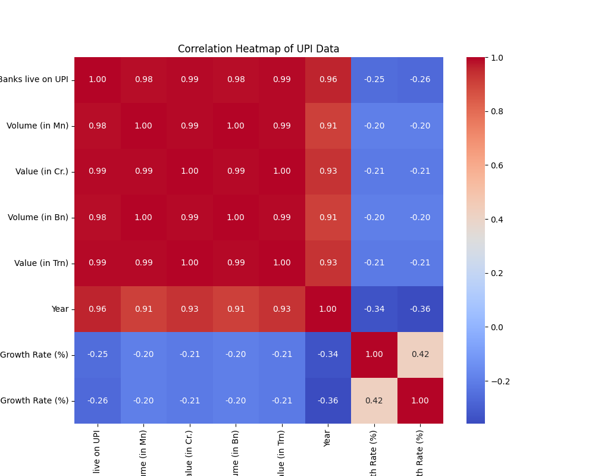

# Analysis of UPI Transaction Growth using SARIMA Forecasting

## 1. Introduction

This report details a comprehensive analysis of UPI transaction data to understand the impact of the COVID-19 pandemic on its growth. This analysis uses the **SARIMA (Seasonal AutoRegressive Integrated Moving Average)** model for all time series forecasting to ensure a consistent and robust methodology.

The analysis is divided into two main parts:
1.  **Pre-COVID vs. During-COVID**: A SARIMA model is trained on pre-pandemic data to forecast the trend during the pandemic.
2.  **(Pre+During)-COVID vs. Post-COVID**: A second SARIMA model is trained on data from both the pre-pandemic and pandemic periods to forecast the trend after the main waves of the pandemic.

This approach allows for a nuanced view of the pandemic's impact. Additionally, several hypothesis tests, including a test for changes in volatility, are conducted to provide statistical backing for the findings.

## 2. Data Cleaning and Preparation

The raw data was cleaned and prepared for analysis. This involved converting data types and splitting the data into three periods:
- **Pre-COVID**: Data up to March 2020.
- **During-COVID**: Data from April 2020 to January 2022.
- **Post-COVID**: Data from August 2022 onwards.
The cleaned data was exported to `upi_data_cleaned.xlsx`.

## 3. Exploratory Data Analysis (EDA)

### Data Distributions
Histograms and box plots were generated for each period to visualize the distribution of transaction volumes.

**Pre-COVID:**

**During-COVID:**

**Post-COVID:**

These plots show a clear shift in the distribution to higher values in each subsequent period.

### Time Series Trends
To visualize the overall trend, a time series plot of the entire dataset was created.

The plot clearly shows an exponential growth trend in both transaction volume and value over time, with a noticeable acceleration around the "During-COVID" period (marked in red).

## 4. SARIMA Forecasting Analysis

### Part 1: Pre-COVID vs. During-COVID

A SARIMA model, which accounts for trend and seasonality, was trained on the Pre-COVID data to forecast the During-COVID period.

- **Statistical Test on Residuals:** A t-test on the forecast residuals yielded a **T-statistic of 5.1217** and a **p-value of 0.0000**.
- **Conclusion:** The actual transaction volumes during the pandemic were **statistically significantly different** from what the SARIMA model predicted based on the pre-COVID trend. This confirms a major shift in user behavior at the onset of the pandemic.

### Part 2: (Pre+During)-COVID vs. Post-COVID

A second SARIMA model was trained on the combined Pre-COVID and During-COVID data. This model, representing the "new normal" trend established during the pandemic, was then used to forecast the Post-COVID period.

-covid_vs_post-covid.png)

- **Statistical Test on Residuals:** A t-test on the residuals of this second forecast yielded a **T-statistic of -5.3953** and a **p-value of 0.0000**.
- **Conclusion:** The growth in the post-COVID era **still significantly differed from the forecast** based on the trend established during the pandemic. The negative t-statistic indicates that the actual values were, on average, lower than the forecast, suggesting that while growth continued, it did not keep pace with the aggressive trajectory projected by the model.

## 5. Additional Hypothesis Tests

### Test for Difference in Average Transactions
A two-sample t-test confirmed that the average transaction volume and value are **statistically significantly higher** in the post-onset period compared to the pre-COVID period (Volume t-statistic: -11.0504, Value t-statistic: -12.6223, p-value = 0.0000 for both).

### Chow Test for Structural Break
A Chow test confirmed a **statistically significant structural break** in the data at the onset of the pandemic (p-value = 0.0000), indicating a fundamental shift in the data's properties.

### Levene Test for Change in Volatility
A Levene test was conducted to compare the variance of the monthly growth rates before and after the pandemic's onset.
- **Levene Statistic:** 5.1980, **P-value:** 0.0248
- **Conclusion:** The p-value is less than 0.05, indicating that the **volatility (variance) of the growth rate is statistically significantly different** between the two periods.

## 6. Final Conclusion

This comprehensive analysis provides several key insights into the impact of the COVID-19 pandemic on UPI transactions:
1.  **Massive Acceleration with Maturation:** The pandemic triggered a massive, statistically significant acceleration in UPI growth that far exceeded the pre-COVID trend. However, the growth in the post-COVID era, while still strong, has begun to show signs of maturation, as it did not keep pace with the aggressive trajectory forecasted based on the pandemic-era trend.
2.  **Fundamental Shift:** The structural break identified by the Chow test and the significant difference in average transactions confirm that the pandemic fundamentally altered UPI usage patterns.
3.  **Increased Volatility:** The significant result of the Levene test shows that the growth has also become more volatile since the pandemic's onset.
---

##  Exploratory Data Analysis (EDA)

A comprehensive Exploratory Data Analysis was conducted to uncover patterns, identify anomalies, and understand the key drivers in the UPI transaction data.

### 1. Descriptive Statistics & Distribution Analysis
The analysis began by segmenting the data into **Pre-COVID**, **During-COVID**, and **Post-COVID** periods. The descriptive statistics revealed an exponential increase in both transaction volume and value. For instance, the average monthly transaction value surged from approximately **₹0.65 trillion** pre-COVID to **₹18.25 trillion** post-COVID. Box plots visually confirmed this dramatic upward shift in the data's distribution, with both the median and interquartile range expanding significantly over time.

- **Key Insight:** The growth in UPI transactions has been explosive and accelerated significantly during and after the COVID-19 pandemic.

### 2. Trend and Growth Rate Analysis
The overall time series shows a strong, persistent upward trend. A 6-month moving average was used to smooth out short-term fluctuations, clearly illustrating the steep trajectory of UPI adoption. The month-over-month growth rate was highly volatile in the early stages but has started to show signs of stabilization in the post-COVID era as the platform matures.

- **Key Insight:** While the overall trend is one of strong growth, the rate of that growth is becoming more consistent.

### 3. Correlation and Feature Analysis
A correlation matrix was generated to understand the relationships between key variables. A near-perfect positive correlation (+0.99) was found between `Volume (in Bn)` and `Value (in Trn)`. Furthermore, the `No. of Banks live on UPI` showed a very strong positive correlation with both volume and value.

- **Key Insight:** The expansion of the UPI network by adding more banks has been a critical driver of its overall growth.

### 4. Time Series Decomposition
To better understand the underlying structure of the data, a seasonal decomposition was performed. This analysis separated the time series into three components:

* **Trend:** Confirmed the strong, accelerating upward trend.
* **Seasonality:** Revealed a consistent seasonal pattern, with transaction activity often peaking at certain times of the year.
* **Residuals:** Isolated the random, irregular noise in the data.

- **Key Insight:** The data exhibits clear trend and seasonal patterns, which must be addressed in our time series modeling to ensure accurate forecasts.

---
