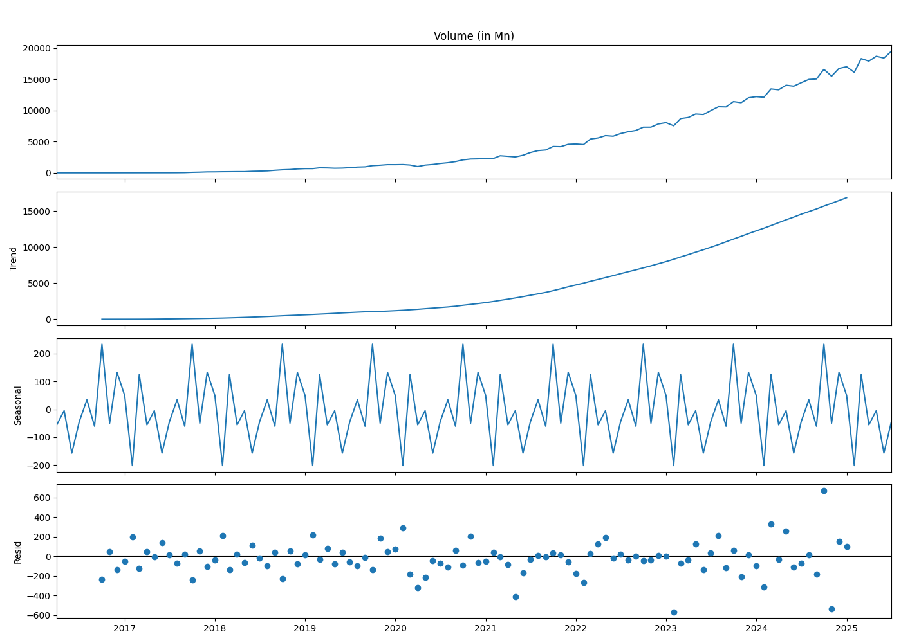
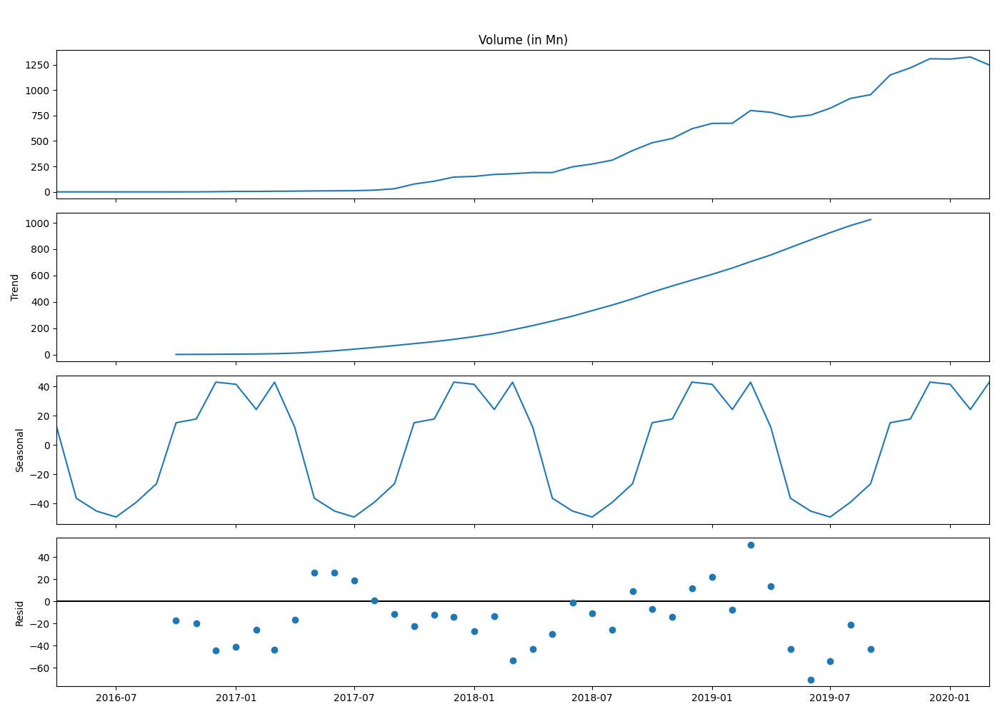
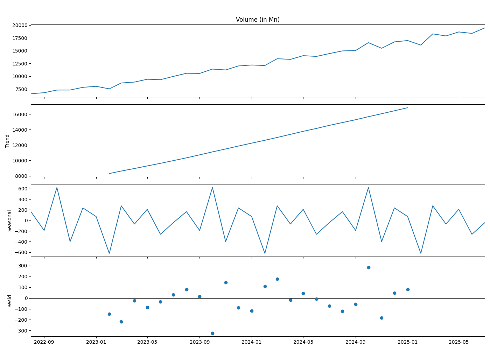
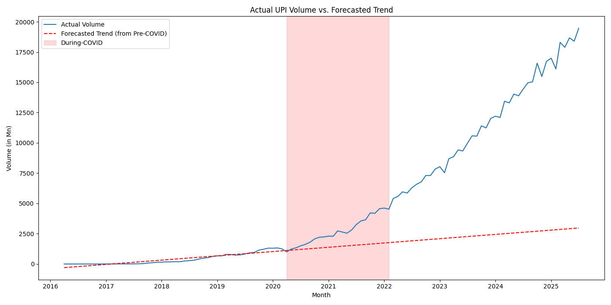

# Analysis of UPI Transaction Growth During the COVID-19 Pandemic

## 1. Introduction

This report details the analysis of UPI transaction data to understand the impact of the COVID-19 pandemic on its growth. The analysis involves data cleaning, exploratory data analysis (EDA), and hypothesis testing to determine if the pandemic caused a significant shift in UPI transaction trends.

## 2. Data Cleaning and Preparation

The raw data from `Untitled spreadsheet - Sheet1.csv` was cleaned and prepared for analysis. This involved:
- Converting the `Month` column to a proper datetime format.
- Cleaning the `Volume (in Mn)` and `Value (in Cr.)` columns by removing commas and converting them to numeric types.
- The data was then split into three periods for analysis:
    - **Pre-COVID**: Data up to March 2020.
    - **During-COVID**: Data from April 2020 to January 2022.
    - **Post-COVID**: Data from August 2022 onwards.
- The cleaned data for these three periods was exported into separate sheets in the `upi_data_cleaned.xlsx` Excel file.

## 3. Exploratory Data Analysis (EDA)

An EDA was conducted on each of the three periods. The key findings include:
- A consistent and strong upward trend in both transaction volume and value over time.
- The rate of growth appears to have steepened significantly during and after the pandemic.
- The summary statistics confirm a substantial increase in the mean and median transaction volumes and values in the During-COVID and Post-COVID periods compared to the Pre-COVID era.
- Visualizations (histograms and box plots) for each period show a rightward shift in the data distribution, confirming the growth over time.

## 4. Hypothesis Testing

Three key hypotheses were tested to statistically validate the observed trends.

### Hypothesis 1: Difference in Average Transactions

- **Null Hypothesis (H0):** There is no significant difference in the average monthly UPI transactions between the pre-pandemic and post-pandemic-onset periods.
- **Test Used:** Independent two-sample t-test.
- **Results:**
    - **Volume:** T-statistic = -11.0504, P-value = 0.0000
    - **Value:** T-statistic = -12.6223, P-value = 0.0000
- **Conclusion:** The p-values for both volume and value are less than 0.05, leading us to **reject the null hypothesis**. There is a statistically significant difference in the average transactions, with the post-pandemic period showing much higher averages.

### Hypothesis 2: Structural Change

- **Null Hypothesis (H0):** The time series of UPI transactions does not have a structural break corresponding to the onset of the COVID-19 pandemic.
- **Test Used:** Chow-like test using a dummy variable regression model.
- **Results:**
    - **F-statistic:** 595.7437, **P-value:** 0.0000
- **Conclusion:** The p-value is less than 0.05, so we **reject the null hypothesis**. This indicates a statistically significant structural break in the UPI transaction data around the onset of the pandemic.

### Hypothesis 3: Impact on Transaction Growth Trend

- **Null Hypothesis (H0):** The growth in UPI transactions did not sustain after the pandemic (i.e., the trend did not significantly change).
- **Test Used:** A t-test on the residuals from a linear trend model fitted on pre-pandemic data.
- **Results:**
    - **T-statistic on residuals:** 9.8686, **P-value:** 0.0000
- **Conclusion:** The p-value is less than 0.05, leading us to **reject the null hypothesis**. The actual transaction volumes in the post-pandemic period are significantly higher than what would have been predicted by the pre-pandemic trend, indicating an acceleration in growth.

## 5. Time Series Decomposition

To better understand the underlying patterns in the UPI transaction data, a time series decomposition was performed. This separates the data into its trend, seasonal, and residual components.

### Overall Decomposition

The overall decomposition clearly shows a strong upward trend and a recurring seasonal pattern.

### Pre-COVID Decomposition

In the pre-COVID era, the trend was still positive but less steep. The seasonal component is present but less pronounced.

### Post-COVID Decomposition

In the post-COVID period, the trend is much steeper, confirming the accelerated growth. The seasonal pattern is also more defined.

*(Note: The "During-COVID" period was too short for a meaningful seasonal decomposition and was therefore skipped.)*

## 6. Forecast vs. Actual Trend Comparison

To visualize the impact of the pandemic on the growth trend, a forecast was generated based on the pre-COVID trend model and compared against the actual transaction volumes.

The plot above clearly illustrates the deviation of the actual transaction volume from the forecasted trend. The red dashed line represents the expected growth trajectory if the pandemic had not occurred. The blue line, representing the actual data, shows a significant and sustained divergence from this forecast, starting from the "During-COVID" period. This provides strong visual evidence that the pandemic acted as a major accelerator for UPI adoption, far exceeding its historical growth path.

## 7. Final Conclusion

The analysis provides strong evidence that the COVID-19 pandemic had a significant and lasting impact on UPI transaction growth. All three hypotheses, supported by the visual evidence from the forecast comparison, confirmed that the post-pandemic period is characterized by:
- Significantly higher average transaction volumes and values.
- A structural break in the data, indicating a fundamental shift in transaction behavior.
- An accelerated growth trend that surpassed the pre-pandemic trajectory.

This suggests that the pandemic acted as a catalyst for digital payment adoption in India, with UPI being a major beneficiary. The growth was not only sustained but significantly boosted.
