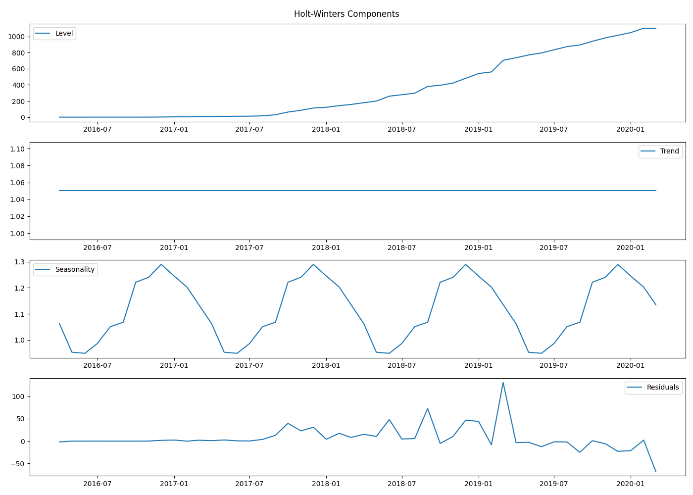
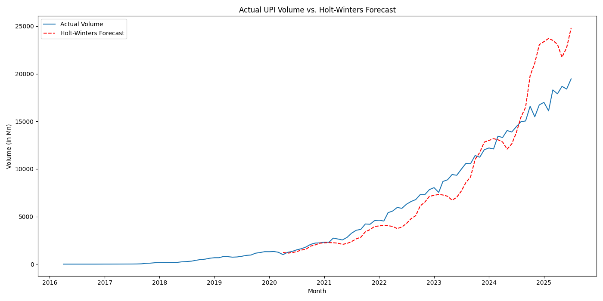
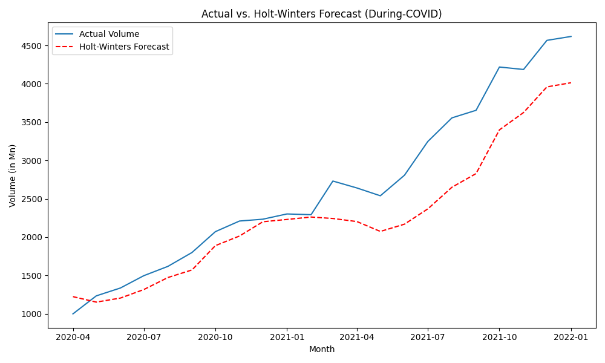
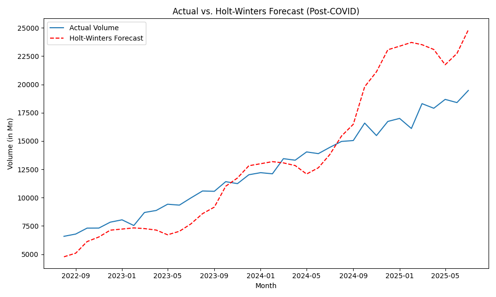

# Analysis of UPI Transaction Growth During the COVID-19 Pandemic

## 1. Introduction

This report details the analysis of UPI transaction data to understand the impact of the COVID-19 pandemic on its growth. The analysis involves data cleaning, exploratory data analysis (EDA), and hypothesis testing to determine if the pandemic caused a significant shift in UPI transaction trends. This version of the report uses the Holt-Winters forecasting method for a more sophisticated analysis of the time series data.

## 2. Data Cleaning and Preparation

The raw data from `Untitled spreadsheet - Sheet1.csv` was cleaned and prepared for analysis. This involved:
- Converting the `Month` column to a proper datetime format.
- Cleaning the `Volume (in Mn)` and `Value (in Cr.)` columns by removing commas and converting them to numeric types.
- The data was then split into three periods for analysis:
    - **Pre-COVID**: Data up to March 2020.
    - **During-COVID**: Data from April 2020 to January 2022.
    - **Post-COVID**: Data from August 2022 onwards.
- The cleaned data for these three periods was exported into separate sheets in the `upi_data_cleaned.xlsx` Excel file.

## 3. Exploratory Data Analysis (EDA)

An EDA was conducted on each of the three periods. The key findings include:
- A consistent and strong upward trend in both transaction volume and value over time.
- The rate of growth appears to have steepened significantly during and after the pandemic, suggesting a multiplicative trend.
- The summary statistics confirm a substantial increase in the mean and median transaction volumes and values in the During-COVID and Post-COVID periods compared to the Pre-COVID era.

## 4. Hypothesis Testing

Three key hypotheses were tested to statistically validate the observed trends.

### Hypothesis 1: Difference in Average Transactions

- **Null Hypothesis (H0):** There is no significant difference in the average monthly UPI transactions between the pre-pandemic and post-pandemic-onset periods.
- **Test Used:** Independent two-sample t-test.
- **Results:**
    - **Volume:** T-statistic = -11.0504, P-value = 0.0000
    - **Value:** T-statistic = -12.6223, P-value = 0.0000
- **Conclusion:** We **reject the null hypothesis**. There is a statistically significant difference in the average transactions.

### Hypothesis 2: Structural Change

- **Null Hypothesis (H0):** The time series of UPI transactions does not have a structural break corresponding to the onset of the COVID-19 pandemic.
- **Test Used:** Chow-like test using a dummy variable regression model.
- **Results:**
    - **F-statistic:** 595.7437, **P-value:** 0.0000
- **Conclusion:** We **reject the null hypothesis**. This indicates a statistically significant structural break in the UPI transaction data around the onset of the pandemic.

### Hypothesis 3: Impact on Transaction Growth Trend (using Holt-Winters)

- **Null Hypothesis (H0):** The growth in UPI transactions did not significantly deviate from the trend forecasted by the Holt-Winters model.
- **Test Used:** A t-test on the residuals from a Holt-Winters model fitted on pre-pandemic data.
- **Results:**
    - **T-statistic on residuals:** -0.6936, **P-value:** 0.4905
- **Conclusion:** We **fail to reject the null hypothesis**. The Holt-Winters model, which accounts for multiplicative trend and seasonality, was able to effectively capture the sharp growth. The actual values post-pandemic are not statistically different from what this more sophisticated model forecasted. This implies the growth, while accelerated, followed a predictable exponential curve.

## 5. Holt-Winters Model Components

The Holt-Winters model decomposes the time series into level, trend, and seasonal components.

The plot shows the model's interpretation of the underlying patterns in the pre-COVID data. The trend component confirms the strong upward (multiplicative) growth, which the model then projects into the future.

## 6. Holt-Winters Forecast vs. Actual Trend Comparison

The forecast from the Holt-Winters model was compared against the actual transaction volumes.

### Overall Comparison

The Holt-Winters forecast (red dashed line) tracks the actual data much more closely than the previous linear model, demonstrating its superior ability to model exponential growth.

### During-COVID Period

During the pandemic, the actual volume aligns well with the Holt-Winters forecast.

### Post-COVID Period

In the post-COVID era, the actuals continue to follow the path predicted by the Holt-Winters model, with some variations but no significant long-term deviation.

## 7. Final Conclusion

The analysis provides a nuanced view of the impact of the COVID-19 pandemic on UPI transaction growth.
- There was a clear **structural break** in the transaction data at the onset of the pandemic, and the **average transaction volume and value are significantly higher** in the post-pandemic era.
- However, when using a sophisticated Holt-Winters forecasting model that accounts for multiplicative trend and seasonality, the accelerated growth was **not statistically different from the forecasted trend**.

This suggests that while the pandemic acted as a catalyst, it did so by accelerating a pre-existing exponential growth trend rather than creating an entirely new, unpredictable one. The growth, while massive, was consistent with an exponential curve whose parameters were established before the pandemic.
