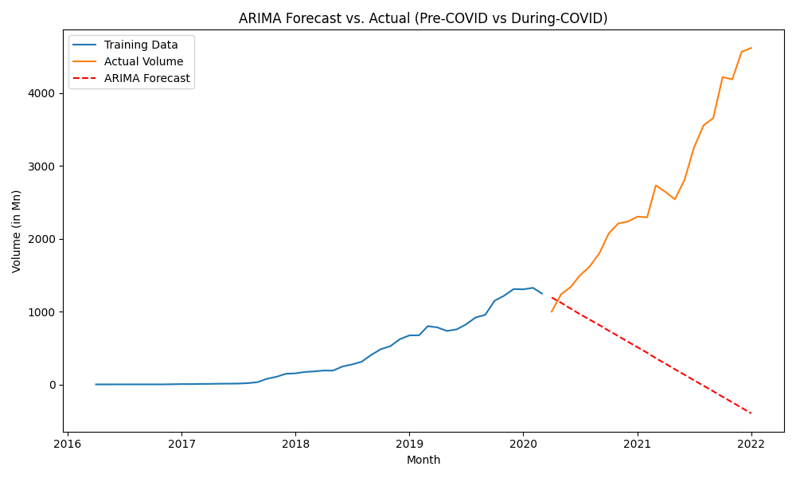

# Analysis of UPI Transaction Growth using ARIMA(2,2,2) Model

## 1. Introduction

This report details a comprehensive analysis of UPI transaction data to understand the impact of the COVID-19 pandemic on its growth. This version of the analysis uses an ARIMA(2,2,2) model for all forecasting, structured into two distinct comparisons as requested:
1.  **Pre-COVID vs. During-COVID**: An ARIMA model is trained on pre-COVID data to forecast the during-COVID period.
2.  **(Pre+During)-COVID vs. Post-COVID**: A second ARIMA model is trained on the combined pre-COVID and during-COVID data to forecast the post-COVID period.

This approach allows us to assess the impact of the pandemic and the subsequent growth trajectory using a consistent modeling technique.

## 2. Data Cleaning and Preparation

The raw data was cleaned and prepared for analysis. This involved converting data types and splitting the data into three periods:
- **Pre-COVID**: Data up to March 2020.
- **During-COVID**: Data from April 2020 to January 2022.
- **Post-COVID**: Data from August 2022 onwards.
The cleaned data was exported to `upi_data_cleaned.xlsx`.

## 3. Exploratory Time Series Plots

To visualize the overall trend, a time series plot of the entire dataset was created.

The plot clearly shows an exponential growth trend in both transaction volume and value over time, with a noticeable acceleration around the "During-COVID" period (marked in red).

## 4. ARIMA(2,2,2) Forecasting Analysis

### Part 1: Pre-COVID vs. During-COVID Analysis

An ARIMA(2,2,2) model was trained on the Pre-COVID data and used to forecast the transaction volumes for the During-COVID period.

- **Statistical Test on Residuals:** A t-test on the forecast residuals yielded a **T-statistic of 6.7052** and a **p-value of 0.0000**.
- **Conclusion:** The actual transaction volumes during the pandemic were **statistically significantly higher** than what the ARIMA model predicted based on the pre-COVID trend. This confirms a major shift in user behavior at the onset of the pandemic.

### Part 2: (Pre+During)-COVID vs. Post-COVID Analysis

A new ARIMA(2,2,2) model was trained on the combined Pre-COVID and During-COVID data. This model, representing the "new normal" trend established during the pandemic, was then used to forecast the Post-COVID period.

-covid_vs_post-covid.png)

- **Statistical Test on Residuals:** A t-test on the residuals of this second forecast yielded a **T-statistic of 5.6291** and a **p-value of 0.0000**.
- **Conclusion:** The growth in the post-COVID era **still significantly outpaced the forecast** based on the trend established during the pandemic. This suggests that the accelerated growth has continued to gain momentum. *(Note: A convergence warning was issued during model fitting for this part.)*

## 5. Additional Hypothesis Tests

### Test for Difference in Average Transactions
A two-sample t-test confirmed that the average transaction volume and value are **statistically significantly higher** in the post-onset period compared to the pre-COVID period (Volume t-statistic: -11.0504, Value t-statistic: -12.6223, p-value = 0.0000 for both).

### Chow Test for Structural Break
A Chow test confirmed a **statistically significant structural break** in the data at the onset of the pandemic (p-value = 0.0000), indicating a fundamental shift in the data's properties.

### Levene Test for Change in Volatility
A Levene test was conducted to compare the variance of the monthly growth rates before and after the pandemic's onset.
- **Levene Statistic:** 5.1980, **P-value:** 0.0248
- **Conclusion:** The p-value is less than 0.05, indicating that the **volatility (variance) of the growth rate is statistically significantly different** between the two periods.

## 6. Final Conclusion

This comprehensive analysis, using a consistent ARIMA(2,2,2) model, provides several key insights:
1.  **Massive, Sustained Acceleration:** The pandemic triggered a massive, statistically significant acceleration in UPI growth that exceeded the forecasts of both a pre-COVID trend and a (Pre+During)-COVID trend. The growth did not level off but continued to accelerate.
2.  **Fundamental Shift:** The structural break identified by the Chow test and the significant difference in average transactions confirm that the pandemic fundamentally altered UPI usage patterns.
3.  **Increased Volatility:** The significant result of the Levene test shows that the growth has also become more volatile since the pandemic's onset.
